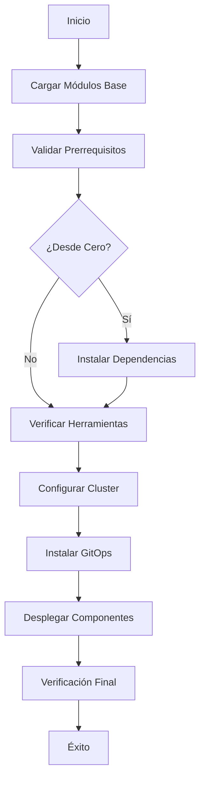

# 📁 Scripts GitOps - Arquitectura Hipermodular

> **Sistema modular de scripts** para gestión automatizada de infraestructura GitOps en español castellano.

[](https://www.gnu.org/software/bash/)
[](README.md)
[](README.md)
[](https://www.shellcheck.net/)

## 📋 Tabla de Contenidos

- [🏗️ Estructura Modular](#️-estructura-modular)
- [🚀 Orquestador Principal](#-orquestador-principal)
- [📦 Módulos Especializados](#-módulos-especializados)
- [🔧 Funciones Principales](#-funciones-principales)
- [🎯 Modos de Ejecución](#-modos-de-ejecución)
- [📊 Sistema de Registro](#-sistema-de-registro)
- [🔍 Depuración y Resolución de Problemas](#-depuración-y-resolución-de-problemas)
- [📖 Guías de Desarrollo](#-guías-de-desarrollo)

## 🏗️ Estructura Modular

### 📁 **Organización por Responsabilidades**

```
📁 scripts/
├── 📄 README.md                    # Esta documentación
├── 📄 orquestador.sh              # 🎯 Coordinador principal
│
├── 📁 comun/                      # 🔧 Módulos base compartidos
│   ├── 📄 base.sh                 # Funciones fundamentales
│   └── 📄 validacion.sh           # Validación de prerrequisitos
│
├── 📁 instalacion/                # 📦 Gestión de dependencias
│   └── 📄 dependencias.sh         # Instalación automática de herramientas
│
└── 📁 cluster/                    # ☸️ Gestión de clusters Kubernetes
    └── 📄 gestor.sh               # Minikube, Kind, configuración
```

### 🎯 **Principios de Diseño**

| Principio | Descripción | Implementación |
|-----------|-------------|----------------|
| **Modularidad** | Cada script tiene una responsabilidad específica | Separación por funcionalidad |
| **Reutilización** | Funciones comunes centralizadas | Módulo `comun/base.sh` |
| **Idioma** | Todo en español castellano | Variables, funciones, mensajes |
| **Calidad** | Cumple estándares de Shell scripting | ShellCheck + mejores prácticas |
| - **Mantenibilidad** | Código fácil de leer y modificar | Documentación en línea |

## 🚀 Orquestador Principal

### 🎼 **orquestador.sh - El Director de Orquesta**

El `orquestador.sh` es el cerebro del sistema que:

```bash
# Funciones principales del orquestador
✅ Coordina todas las fases de instalación
✅ Gestiona la carga dinámica de módulos
✅ Maneja errores con limpieza automática
✅ Proporciona logging detallado y estructurado
✅ Soporta múltiples modos de ejecución
✅ Valida dependencias entre módulos
```

### 🔄 **Fases del Proceso Automatizado**

| Fase | Responsable | Función | Estado |
|------|-------------|---------|--------|
| **1️⃣ Validación** | `comun/validacion.sh` | Verificar prerrequisitos del sistema | ✅ |
| **2️⃣ Dependencias** | `instalacion/dependencias.sh` | Instalar herramientas base | ✅ |
| **3️⃣ Cluster** | `cluster/gestor.sh` | Configurar cluster Kubernetes | ✅ |
| **4️⃣ GitOps** | `instalar.sh` | Instalar herramientas GitOps | ✅ |
| **5️⃣ Componentes** | `instalar.sh` | Desplegar stack de observabilidad | ✅ |
| **6️⃣ Verificación** | `instalar.sh` | Validar estado final del sistema | ✅ |

### 🎮 **Interface de Control**

```bash
# Ejecutar proceso completo (recomendado)
./orquestador.sh

# Modo debug con salida detallada
./orquestador.sh --debug

# Solo validar prerrequisitos
./orquestador.sh --solo-validacion

# Reinstalar desde dependencias
./orquestador.sh --desde-cero
```
- **solo-cluster**: Solo configuración del cluster
- **solo-gitops**: Solo herramientas GitOps
- **solo-componentes**: Solo componentes adicionales

## 📦 Módulos Especializados

### 🔧 **comun/base.sh - Funciones Fundamentales**

```bash
# 🎨 Sistema de Logging Avanzado
log_success "✅ Operación completada"
log_error "❌ Error crítico detectado"
log_warning "⚠️ Advertencia importante"
log_info "ℹ️ Información general"
log_debug "🔍 Detalles técnicos"
log_section "📋 Nueva Sección"

# 🔍 Validaciones del Sistema
comando_existe "docker"         # Verificar si comando está disponible
es_root                          # Verificar privilegios de administrador
es_wsl                          # Detectar entorno WSL
tiene_systemd                   # Verificar soporte systemd
verificar_internet              # Conectividad a internet

# 🛠️ Utilidades Generales
confirmar "¿Continuar con la instalación?"
obtener_distribucion            # Detectar distribución Linux
verificar_recursos 4 10         # Validar 4GB RAM, 10GB disco
ejecutar_con_retry "comando" 3 5 # 3 intentos, 5s entre intentos
limpiar_al_salir               # Limpieza automática en caso de error
```

### 🔍 **comun/validacion.sh - Verificación de Prerrequisitos**

```bash
# 🖥️ Validaciones del Sistema Operativo
validar_sistema_operativo       # Ubuntu/Debian/CentOS compatible
validar_dependencias_basicas    # curl, wget, git, etc.
validar_recursos_sistema        # RAM, CPU, disco suficientes
validar_conectividad           # Acceso a repositorios externos

# ☸️ Validaciones GitOps Específicas
validar_herramientas_gitops     # kubectl, helm, etc.
validar_puertos_disponibles     # Puertos para servicios GitOps
validar_docker_funcional        # Docker daemon operativo

# 🎯 Validación Completa
validar_prerequisitos_completos # Ejecuta todas las validaciones
generar_reporte_validacion      # Informe detallado del estado
```

### 📦 **instalacion/dependencias.sh - Gestión de Herramientas**

```bash
# 🐳 Instalación de Docker
instalar_docker_ubuntu          # Instalación específica para Ubuntu
instalar_docker_debian          # Instalación específica para Debian
configurar_docker_usuario       # Añadir usuario al grupo docker
verificar_docker_funcional      # Test de funcionamiento

# ☸️ Herramientas Kubernetes
instalar_kubectl_compatible     # kubectl compatible con minikube
instalar_minikube_ultima        # Última versión estable de minikube
instalar_helm_v3                # Helm v3 para gestión de charts
instalar_argocd_cli             # Cliente de línea de comandos ArgoCD

# 🔄 Instalación Inteligente
auto_detectar_e_instalar        # Detecta herramientas faltantes
actualizar_herramientas         # Actualiza a últimas versiones
verificar_compatibilidad        # Verifica compatibilidad entre versiones
```

### ☸️ **cluster/gestor.sh - Gestión de Clusters**

```bash
# 🏗️ Creación de Clusters
crear_cluster_desarrollo        # Cluster con capacidad completa
crear_cluster_preproduccion     # Cluster con recursos mínimos
crear_cluster_produccion        # Cluster optimizado para producción

# ⚙️ Configuración Avanzada
configurar_addons_esenciales    # metrics-server, ingress, dns
configurar_storage_classes      # Clases de almacenamiento
configurar_network_policies     # Políticas de red
configurar_rbac                 # Control de acceso basado en roles

# 🔧 Gestión y Mantenimiento
validar_cluster_healthy         # Verificar estado del cluster
obtener_informacion_cluster     # Información detallada del cluster
cambiar_contexto_cluster        # Cambiar entre clusters
eliminar_cluster_seguro         # Eliminación con confirmación
```

## 🔧 Funciones Principales

### 🎯 **Modos de Ejecución Disponibles**

| Modo | Comando | Descripción | Uso |
|------|---------|-------------|-----|
| **Proceso Completo** | `./orquestador.sh` | Instalación autónoma completa | Producción |
| **Solo Validación** | `./orquestador.sh --validar` | Solo verificar prerrequisitos | Diagnóstico |
| **Desde Cero** | `./orquestador.sh --desde-cero` | Incluye instalación de dependencias | Primera vez |
| **Solo Cluster** | `./orquestador.sh --solo-cluster` | Solo configurar cluster K8s | Testing |
| **Ejecución en seco** | `./orquestador.sh --dry-run` | Simular sin ejecutar | Planificación |
| **Debug** | `./orquestador.sh --debug` | Salida detallada | Resolución de problemas |

### 🔄 **Flujo de Ejecución**



## 🎯 Modos de Ejecución

### 🚀 **Modo Producción (Recomendado)**
```bash
# Instalación completa desatendida
./orquestador.sh

# Características:
✅ Instalación autónoma sin intervención
✅ Validación completa de prerrequisitos
✅ Configuración optimizada para GitOps
✅ Verificación automática del estado final
```

### 🔍 **Modo Diagnóstico**
```bash
# Solo validar el sistema
./orquestador.sh --validar

# Generar reporte completo
./orquestador.sh --validar --reporte

# Características:
✅ No ejecuta instalaciones
✅ Verifica todos los prerrequisitos
✅ Genera reporte detallado
✅ Ideal para troubleshooting
```

### 🧪 **Modo Pruebas**
```bash
# Simular instalación completa
./orquestador.sh --dry-run

# Solo cluster para desarrollo
./orquestador.sh --solo-cluster --perfil dev

# Características:
✅ Seguro para testing
✅ No modifica el sistema
✅ Muestra todos los comandos
✅ Perfecto para desarrollo
```

## 📊 Sistema de Registro

### 🎨 **Niveles de Log Estructurados**

```bash
# Ejemplo de salida con colores y símbolos
[2024-08-05 10:30:45] 📋 SECCIÓN: Configurando Docker
[2024-08-05 10:30:46] ℹ️  INFO: Verificando Docker daemon...
[2024-08-05 10:30:47] ✅ SUCCESS: Docker está funcionando correctamente
[2024-08-05 10:30:48] ⚠️  WARNING: Puerto 8080 ya está en uso
[2024-08-05 10:30:49] ❌ ERROR: No se pudo conectar a Docker daemon
[2024-08-05 10:30:50] 🔍 DEBUG: Ejecutando comando: docker info
```

### 📁 **Gestión de Logs**

```bash
# Configuración automática de logging
export LOG_FILE="/tmp/gitops-instalador-$(date +%Y%m%d-%H%M%S).log"
export LOG_LEVEL="INFO"  # ERROR, WARNING, INFO, DEBUG, TRACE
export SHOW_TIMESTAMP="true"
export LOG_TO_FILE="true"

# Logs estructurados por componente
logs/
├── sistema-$(date).log      # Logs del sistema
├── docker-$(date).log       # Logs específicos de Docker
├── kubernetes-$(date).log   # Logs del cluster K8s
└── gitops-$(date).log       # Logs de herramientas GitOps
```

## 🔍 Depuración y Resolución de Problemas

### 🛠️ **Herramientas de Depuración**

```bash
# Activar modo depuración global
export DEBUG="true"
export VERBOSE="true"

# Depuración específica por módulo
export DEBUG_DOCKER="true"
export DEBUG_KUBERNETES="true"
export DEBUG_GITOPS="true"

# Ejecutar con máximo detalle
./orquestador.sh --depuracion --verbose --trace
```

### 🚨 **Diagnóstico de Problemas Comunes**

| Problema | Diagnóstico | Solución |
|----------|-------------|----------|
| Docker no funciona | `verificar_docker_funcional` | Reiniciar daemon, verificar permisos |
| kubectl no conecta | `validar_cluster_healthy` | Verificar contexto, certificados |
| Recursos insuficientes | `validar_recursos_sistema` | Liberar memoria, aumentar límites |
| Red no accesible | `validar_conectividad` | Verificar DNS, proxy, firewall |

### 📋 **Scripts de Utilidad**

```bash
# Verificar estado completo del sistema
./utilidades/verificar-estado-completo.sh

# Limpiar instalación fallida
./utilidades/limpiar-instalacion-fallida.sh

# Generar reporte de diagnóstico
./utilidades/generar-reporte-diagnostico.sh

# Backup de configuraciones críticas
./utilidades/backup-configuraciones.sh
```

## 📖 Guías de Desarrollo

### 🔧 **Estándares de Código**

```bash
# Nomenclatura en español
function instalar_docker() {        # ✅ Función en español
    local nombre_usuario="$1"       # ✅ Variable en español
    log_info "Instalando Docker..." # ✅ Mensaje en español
}

# Validación de entrada
function validar_parametros() {
    [[ $# -lt 1 ]] && {
        log_error "Se requiere al menos un parámetro"
        return 1
    }
}

# Manejo de errores
function ejecutar_comando_critico() {
    local comando="$1"
    
    if ! $comando; then
        log_error "Error ejecutando: $comando"
        limpiar_al_salir
        return 1
    fi
}
```

### 📝 **Plantilla para Nuevos Módulos**

```bash
#!/bin/bash

# ============================================================================
# MÓDULO: [Nombre del Módulo]
# DESCRIPCIÓN: [Descripción clara de la funcionalidad]
# AUTOR: [Tu nombre]
# VERSIÓN: 1.0.0
# ============================================================================

set -euo pipefail

# Cargar módulos base si no están cargados
if [[ -z "${GITOPS_BASE_LOADED:-}" ]]; then
    SCRIPT_DIR="$(cd "$(dirname "${BASH_SOURCE[0]}")" && pwd)"
    source "$SCRIPT_DIR/../comun/base.sh"
fi

# ============================================================================
# FUNCIONES PRINCIPALES
# ============================================================================

# Función principal del módulo
function main() {
    log_section "🚀 [Nombre del Módulo]"
    
    # Tu código aquí
    
    log_success "✅ [Módulo] completado exitosamente"
}

# ============================================================================
# EJECUCIÓN
# ============================================================================

# Ejecutar si es llamado directamente
if [[ "${BASH_SOURCE[0]}" == "${0}" ]]; then
    main "$@"
fi
```

### 🧪 **Pruebas y Validación**

```bash
# Pruebas unitarias para funciones
function test_instalar_docker() {
    log_section "🧪 Pruebas: instalar_docker"
    
    # Simulación de comandos para pruebas
    function docker() { echo "Docker version 20.10.0"; }
    
    # Ejecutar función
    if instalar_docker; then
        log_success "✅ Prueba superada: instalar_docker"
    else
        log_error "❌ Prueba fallida: instalar_docker"
        return 1
    fi
}

# Ejecutar todos los tests
function ejecutar_tests() {
    test_instalar_docker
    test_configurar_cluster
    test_validar_sistema
}
```

### 📚 **Documentación de Funciones**

```bash
# ============================================================================
# FUNCIÓN: instalar_docker
# DESCRIPCIÓN: Instala Docker Engine en el sistema
# PARÁMETROS:
#   $1 - Distribución Linux (ubuntu|debian|centos)
#   $2 - Versión específica (opcional, default: latest)
# RETORNA:
#   0 - Instalación exitosa
#   1 - Error en la instalación
# EJEMPLO:
#   instalar_docker "ubuntu" "20.10.0"
# ============================================================================
function instalar_docker() {
    local distribucion="${1:-ubuntu}"
    local version="${2:-latest}"
    
    log_info "Instalando Docker $version en $distribucion..."
    
    # Tu implementación aquí
}
```

## 🤝 Contribución al Proyecto

### 📋 **Guías de Contribución**

1. **Bifurcar y Clonar**: Crear fork del repositorio
2. **Rama de Característica**: Crear rama para nueva funcionalidad
3. **Estándares**: Seguir nomenclatura en español
4. **Pruebas**: Añadir pruebas para nuevas funciones
5. **Documentación**: Actualizar README.md si es necesario
6. **Pull Request**: Solicitar revisión de cambios

### 🔧 **Configuración de Desarrollo**

```bash
# Configurar entorno de desarrollo
git clone https://github.com/tu-usuario/gh-gitops-infra.git
cd gh-gitops-infra/scripts

# Configurar hooks de pre-commit
cp utilidades/pre-commit.sh .git/hooks/pre-commit
chmod +x .git/hooks/pre-commit

# Ejecutar validaciones
./utilidades/validar-codigo.sh
./utilidades/ejecutar-tests.sh
```

---

<div align="center">

**🚀 Arquitectura Hipermodular para GitOps en Español 🇪🇸**

*Desarrollado con las mejores prácticas de Shell scripting*

[⬆️ Volver al README principal](../README.md)

</div>
source "$SCRIPTS_DIR/orquestador.sh"
run_orchestrator "$MODO_INSTALACION"
```

## 🚧 Desarrollo Futuro

### Módulos Pendientes

- **gitops/**: Instalación y configuración de ArgoCD, Kargo, etc.
- **componentes/**: Prometheus, Grafana, External Secrets, Cert-Manager
- **utilidades/**: Scripts de mantenimiento, copia de seguridad, actualización, etc.

### Mejoras Planificadas

- **Pruebas automatizadas**: Suite de pruebas para cada módulo
- **Documentación**: Documentación detallada de cada función
- **CI/CD**: Integración continua para validar cambios
- **Métricas**: Recopilación de métricas de instalación

## 📖 Uso

### Instalación Completa

```bash
# Usar a través del instalador principal
./instalar.sh normal

# O directamente el orquestador
./scripts-new/orquestador.sh normal
```

### Uso Modular

```bash
# Solo validar prerequisitos
source ./scripts-new/comun/validacion.sh
validar_prerequisitos

# Solo crear cluster
source ./scripts-new/cluster/gestor.sh
crear_cluster_minikube "mi-cluster"

# Solo instalar dependencias
source ./scripts-new/instalacion/dependencias.sh
instalar_dependencias
```

---

**📝 Nota**: Esta es la nueva estructura modular que reemplaza la organización anterior. Los scripts antiguos se mantendrán temporalmente para compatibilidad hacia atrás, pero se recomienda migrar a esta nueva estructura.
